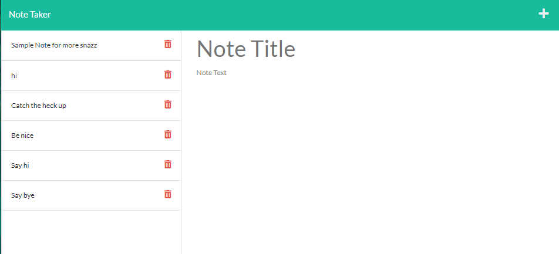

# Note Taker
An application to write and save note with Express.js back end and will save and retrieve note data from JSON file.

### Github: https://github.com/AjiaHoliday/note-taker
### Deployed app: https://evening-stream-11998.herokuapp.com/notes

## User Story
* AS A small business owner
* I WANT to be able to write and save notes
* SO THAT I can organize my thoughts and keep track of tasks I need to complete

## Usage
- Application will allow user to be able to add note's title and description
- Application will allow user to be able to save the notes and won't lose them even they refresh the page
- Application will allow user to be delete notes

## Screenshots

## Technologies Use

<a href="https://nodejs.org/">Node.js</a>

<a href="https://www.npmjs.com/">NPM</a>

<a href="https://www.npmjs.com/package/express">Express.js</a>

<a href="https://www.npmjs.com/package/inquirer">Inquirer.js</a>

<a href="https://www.npmjs.com/package/uuid">uuid</a>

## Contributor:
Ajia Holiday ©2021